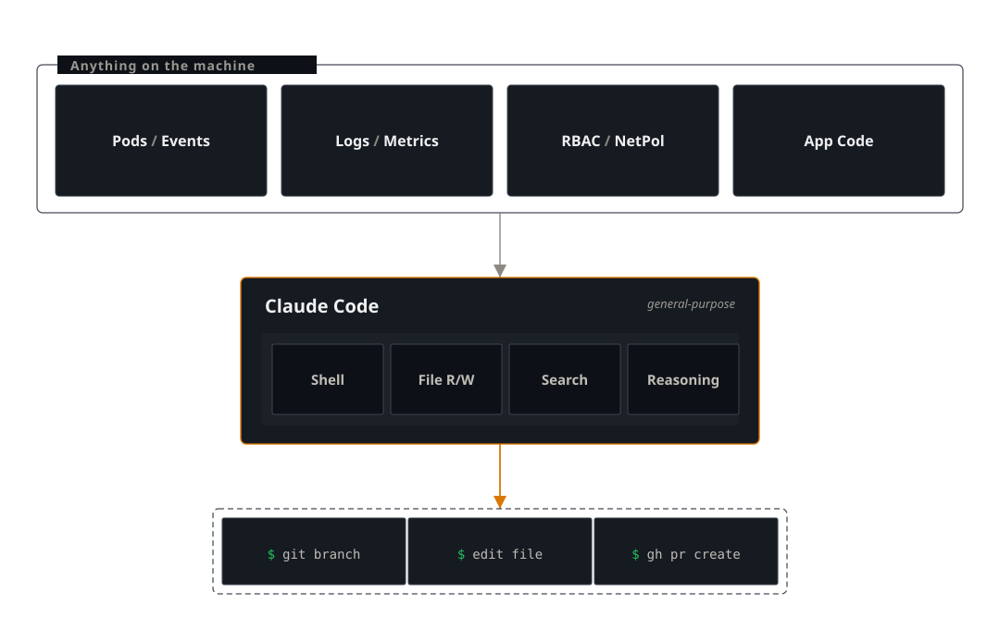

# 01 — The Harness Problem
*Why most AI SREs hit a capability cliff*

A `checkout` pod in the `ecommerce` namespace of a local Kubernetes cluster is crashing. Three AI SRE tools are asked the same question. One returns template advice. One investigates thoroughly and finds the root cause but cannot fix it. One walks the cluster, finds the root cause, and could open the PR.

The models are comparable. The harness is not.

**Tool 1:** [k8sgpt](https://github.com/k8sgpt-ai/k8sgpt) receives the pod error string and returns generic advice: "Check logs, review container image & code, verify resource limits, check env variables." No mention of NetworkPolicy — the model has no way to know about it. The harness gives it one error string and nothing else.

**Tool 2:** [HolmesGPT](https://github.com/robusta-dev/holmesgpt) runs 18 tool calls against the live cluster — reads logs, checks the database service across namespaces, finds the `restrict-egress` NetworkPolicy, inspects its YAML, checks namespace labels, and identifies the root cause: `role: data-tier` is missing from the `database` namespace. It even proposes `kubectl label namespace database role=data-tier`. But when asked to apply the fix, it fails — HolmesGPT is read-only by design. The diagnosis is complete; the remediation boundary is where it stops.

**Tool 3:** [Claude Code](https://claude.com/claude-code) follows the same investigation path — CrashLoopBackOff, logs, cross-namespace service checks, NetworkPolicy inspection, namespace label mismatch — and identifies the same root cause. The difference: Claude Code can apply the fix, edit source files, create a branch, and open a PR. The investigation-to-remediation loop closes in one session.

Same model class, same cluster. The first tool sees only an error string. The second two see the full cluster, and both find the root cause. The difference is what happens next — this is the harness problem.

| Capability | k8sgpt | HolmesGPT | Claude Code |
|---|---|---|---|
| Read logs | No (receives error string only) | Yes | Yes |
| Cross-namespace check | No | Yes | Yes |
| Inspected NetworkPolicy | No | Yes | Yes |
| Found the label mismatch | No | Yes | Yes |
| Root cause identified | No | Yes | Yes |
| Can apply the fix | No | No — read-only by design | Yes |
| Can write code and open a PR | No | No | Yes |

The scenario, transcripts, and manifests are in the repo at [`scenarios/harness-vs-model/`](https://github.com/har-ki/claude-code-sre-handbook/tree/main/scenarios/harness-vs-model) — reproduce it yourself.

## What "AI SRE" means today

A handful of projects have staked out the "AI for Kubernetes operations" space, with three distinct architectures:

- [k8sgpt](https://github.com/k8sgpt-ai/k8sgpt) (CNCF Sandbox): Utilizes analyzers that focus on known Kubernetes resource failures via rule-based Go code. The `--explain` flag uses an LLM to rephrase findings but does not enhance investigation or tool access.
- [HolmesGPT](https://github.com/robusta-dev/holmesgpt) (CNCF Sandbox): An agentic investigator. The LLM iteratively calls tools from a configurable toolset (Kubernetes, Prometheus, Grafana, Datadog, GitHub Actions) for multi-turn investigations. Read-only by design; respects RBAC. In the opener's experiment, HolmesGPT ran 18 tool calls and found the root cause — diagnosis matches Claude Code. The read-only boundary is where the two diverge: HolmesGPT cannot apply the fix.
- Observability vendor AI: Most vendors offer an AI assistant built on alerting and metrics. These tools mainly summarize alerts and provide limited investigative depth compared to dedicated SRE solutions.

Some of these tools diagnose well — HolmesGPT's investigation in the opener is thorough. But none combine diagnosis and fix into a single, seamless process that ends with a code change.

## The harness problem

A *harness* is scaffolding that lets a model interact with its tools, prompts, and operations.

The harness problem limits a model: it knows much but acts only through its tools.

If the harness blocks an action, the model simply gives its best answer, not an error.

AI SRE tools tend to hit three cliffs:

- Cross-domain issues. k8sgpt-class tools can't connect findings because analyzers run independently. HolmesGPT's agentic loop crosses domains — in the opener it followed a connection failure across namespaces to a NetworkPolicy and identified the label mismatch. This cliff varies by tool design, and HolmesGPT clears it.
- Application code issues. Cluster problems may come from bugs in app code. Most tools can't access the codebase and miss the cause. HolmesGPT can do some code investigation, but most tools can't cross between cluster and code.
- Writing a fix. Closing the loop. No tool in the AI SRE category writes a patch and opens a PR:
    - HolmesGPT — finds the root cause, proposes the fix command, but cannot execute it. Read-only by design.
    - k8sgpt — detection-and-explanation.
    - Observability AI — summarization-of-alert layers.

    Even when an agent identifies the exact fix, the output is prose. An engineer must still apply the change, create a branch, commit, and PR.

The third cliff is the one that matters most. HolmesGPT proves that agentic investigation can match a general-purpose harness on diagnosis. But without write access, the loop stays open. This gap — between knowing the fix and applying it — is what separates AI assistance from a complete SRE process. The series will focus on closing it.

## Why Claude Code has the right shape

[Claude Code](https://claude.com/claude-code) does not ship an SRE toolset. Its built-in tools are general-purpose:

- a shell
- file read, write, and edit
- search primitives
- free-form reasoning

None of it is SRE-specific. There is no `analyze_pod`. There is no `check_image_pull`. There is no theory of operational categories.

This isn't a missing feature; it's by design.

Given a shell and file read, an agent investigating the opening case does what an engineer would do: it runs `kubectl describe pod`, sees the registry pull failure, then runs `kubectl get networkpolicy -A`, sees the recent change, then `kubectl get networkpolicy <name> -o yaml`, reads it, and explains the egress restriction. Nobody pre-decided that `ImagePullBackOff` and `NetworkPolicy` were composable categories. The composition emerged from reasoning over a general action space.

Given file read and edit, the same agent can `cat` a source file, find the bug, propose a patch, and — with a shell and `gh` available — open a PR. The "investigation → root cause → code fix → PR" arc is one continuous session, not three handoffs across three tools.

In 2019, Rich Sutton wrote an essay called [The Bitter Lesson](http://www.incompleteideas.net/IncIdeas/BitterLesson.html), arguing that general methods consistently outpace hand-engineered knowledge in AI. Chess, Go, speech, vision — domain expertise is surpassed as general methods get more compute.

Key lesson: general-purpose harnesses capture complexity and outperform fixed-scope tools over time. The gap will widen as models strengthen.

## What this harness is missing

The harness shape is correct, but supporting systems are still needed. Three gaps matter:

- Memory. Claude Code lacks automatic memory across incidents. Continuity depends on what's in the workspace. For on-call teams, deliberate design is needed.
- Guardrails. A general-purpose shell is general-purpose. Tool-use approval prompts exist, and permission scoping is configurable, but the harder pieces have to be built around the harness, not assumed in it:
    - read-only defaults for cluster operations
    - approval gates for state-changing calls
    - dry-run for code patches
    - audit trails
- Triggers. Claude Code is on-demand: you start a session, you type. SRE work has another mode — push, event-driven, alert-fired at three in the morning. Hooking the harness to alert webhooks, `kube-event-exporter`, or scheduled scans turns it into an always-on system. That is a different beast with different failure modes (runaway loops, alert fatigue 2.0, cost), and it deserves its own post. It will get one.

Supporting systems matter just as much as harness shape. A terminal-only solution lacks operational value without memory, guardrails, and triggers.

## A checklist for evaluating an AI SRE tool

If you are looking at an AI SRE product today — your own or a vendor's — five questions will tell you what kind of harness it has:

1. How does the tool behave when the problem does not match any category in its toolset or analyzer library? If the answer is "we add a new analyzer," the product lags every novel incident by one release cycle.
2. Can the agent read arbitrary files in your repositories, including service source code, by default? If only with a custom toolset configuration, the default user experience stops at the cluster boundary.
3. Can it write a patch and open a pull request? If no, the diagnosis is the deliverable, and a human still does the work.
4. How does the action space change when the underlying model gets stronger? If the answer is "it does not, our tools are fixed," the product is decoupled from the trend line it depends on.
5. What does a session transcript look like when the tool fails? Vendors who will not show you a failure transcript have not earned the demo.

## What this series covers

- Build a Skill that takes Claude Code from investigation to pull request on an ecommerce incident.
- Benchmark it across canonical Kubernetes failure scenarios.
- Re-run the same work air-gapped — Qwen3.6 served by Ollama on a laptop, no API calls leaving the machine — with an honest account of what holds up and what breaks.
- Close with on-demand versus always-on architectures and a reference watcher.

Every post ships an artifact: code, transcripts, benchmark data, or a demo.

Next: [Post 2](02-investigation-to-pr.md) puts a real Kubernetes cluster in front of this argument and times the loop — investigation to pull request in under six minutes.

---

*Working through this on your own infrastructure? Happy to jam — [drop me a line](https://github.com/har-ki).*
