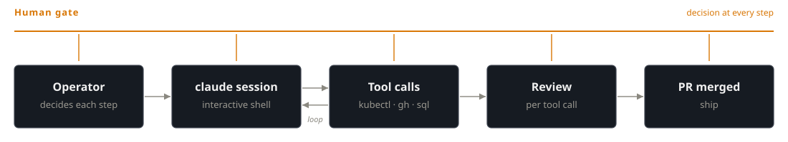
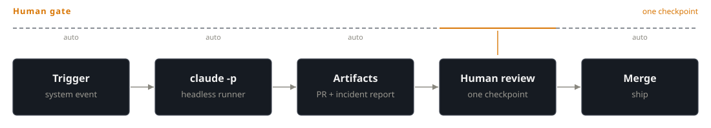

# 04 — On-Demand vs Always-On: Choosing

*Two architectures for production AI SRE. Pick one per workflow.*

The benchmark from [Post 3](03-five-incidents-frontier.md) showed Claude Code works on canonical incidents. The next question: how to deploy it — operator-in-the-loop or fully automated? This post maps the decision; [Post 5](05-building-the-always-on-watcher.md) builds it.

## On-demand

Operator opens a session, types prompts, watches tool calls, and merges the PR. Decision authority at every step.

{ width="100%" }

## Always-on

Trigger fires. Runner invokes `claude -p` headless. Outputs create artifacts: PR with fix and incident report. Human reviews artifacts only. Decision at one checkpoint.

{ width="100%" }

## Compare

| | On-demand | Always-on |
|---|---|---|
| Trigger | Operator | System event |
| Loop driver | Human prompts | Prompt template |
| Review point | Per tool call | Per artifact |
| Cost ceiling | Operator's patience | Daily $ cap per fingerprint |
| Onboarding | One `claude` install | Repo + runner + gate |
| Failure detection | Operator notices | Audit log + bad PRs |

## Decide

Scan options top-down. Stop at the first that fits.

1. **New workflow?** Start on-demand. Run it manually for weeks. Analyze transcripts. Guardrails require firsthand observation.

2. **High-stakes — production, regulated, irreversible?** Use on-demand. Cost of gate failure outweighs manual involvement.

3. **High-volume, low-variance, fully understood, clean trigger?** Always-on is fit. Examples: CVE upgrades, right-sizing, postmortem drafts, alert-tuning proposals.

4. **Does the workflow interrupt engineers to chase issues that agents could investigate first?** Use always-on for investigation only. Output: structured brief. Human decides what action follows.

5. **Anything else stays on-demand.**

## Know before you ship

| Failure | What it looks like | Mitigation |
|---|---|---|
| Runaway loop | Same alert → 50 draft PRs by morning | Fingerprint dedup; daily invocation cap; comment-on-existing instead of new PR |
| Cost explosion | Opus on every alert; one bad rule = $1000/day | Smallest model that works; escalate on low confidence; hard daily $ cap |
| Alert fatigue 2.0 | 5 draft PRs/day, 4 non-actionable | Don't wire agent to noisy alerts. The agent is not an alert-quality strategy. |
| Hallucinated root cause | Confident wrong cause; clean diff against wrong bug | Phase 2 restates Phase 1 verbatim in the PR; real PR review |
| Log-borne prompt injection | Attacker writes instructions into log body | Read-only investigation phase; no write tools the injection can weaponize |

Most always-on failures amplify problems you already have. Noisy alerts get noisier. Bad code review gets worse. Loose credentials get more loosely abused. The agent doesn't cause these — it surfaces them faster.

## Next

If always-on fits a specific workflow on your stack, [Post 5](05-building-the-always-on-watcher.md) walks through the reference build. Same scenario as [Post 2](02-investigation-to-pr.md) — ecommerce + ClickHouse OTel + TOCTOU race — running headless behind a GitHub draft-PR gate, producing both a fix and a draft incident report.

---

*Working through this on your own infrastructure? Happy to jam — [drop me a line](https://github.com/har-ki).*
