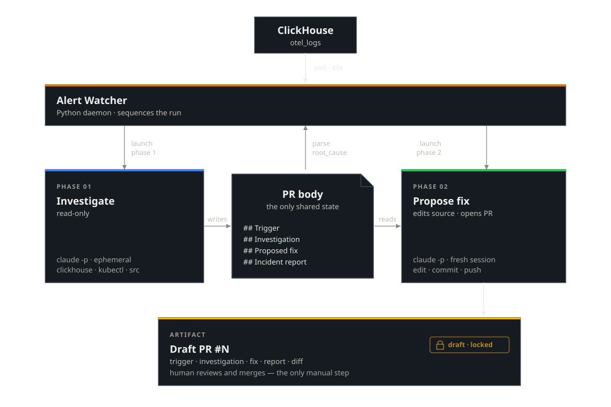

# 05 — Building the Always-On Watcher
*A Python daemon, two Claude Code invocations, a draft PR.*

*A Python daemon watches error rates, hands broken services to Claude Code in two phases, and produces a draft PR. Six minutes, $0.68, one human review step. The reference implementation is in the repo — fork it before pointing it at a real service.*

A human SRE team works a well-worn loop. A monitoring system fires an alert. The on-call engineer opens a laptop, checks dashboards and logs, reads the relevant source code, identifies the root cause, writes a fix, opens a pull request, and hands it to a teammate for review. The fix doesn't go to production until that teammate approves.

This post builds the same loop with Claude Code. A Python daemon watches error rates. When something breaks, it hands the problem to Claude in two phases: investigate, then propose a fix. The result is a draft pull request with a root-cause analysis and a working code change. A human still reviews and merges. The system cannot deploy its own work.

| Step | Human on-call team | This system |
|------|-------------------|-------------|
| Detect | PagerDuty/Grafana alert wakes engineer | Watcher polls error rates, fires on threshold breach |
| Triage | Engineer checks if it's a known issue | Watcher fingerprints the error, deduplicates against open PRs |
| Investigate | Engineer reads logs, traces, source code | Phase 1: Claude queries observability data + reads source |
| Fix | Engineer writes a patch, opens a PR | Phase 2: Claude commits a fix to a feature branch |
| Document | Engineer writes a post-mortem | Phase 2: Claude commits a structured incident report |
| Review | Teammate reviews and merges | Human un-drafts the PR and merges — the only manual step |

We ran it against a live race condition in an ecommerce checkout service. Six minutes from alert to a draft PR containing root-cause analysis, trace correlation, and a working fix. Total cost: $0.68. That's a page that never wakes anyone up, and MTTR measured in minutes instead of hours. [PR #28](https://github.com/har-ki/claude-code-sre-handbook/pull/28) is the evidence — open it, read the investigation, inspect the diff.

The architecture decision is [Post 4](04-on-demand-vs-always-on-choosing.md). The scenario is [Post 2's](02-investigation-to-pr.md) ecommerce TOCTOU bug, now running headless. The reference implementation lives in [`watcher-example/`](https://github.com/har-ki/claude-code-sre-handbook/tree/main/watcher-example). The rest of this post is the technical how-to.

## Architecture

Four components, one `docker compose up`:

| Component | Role |
|---|---|
| `alert-watcher/` | Python daemon. Polls, fingerprints, dedups, opens PRs, orchestrates phases. |
| `claude-runner/` | Docker container with `claude`, `kubectl`, `gh`, `git`. One invocation per phase. |
| `memory-store/incidents.jsonl` | Append-only log. One line per completed incident. |
| `audit-log/` | Stream-json transcript per phase per incident. Every tool call recorded. |

The runner mounts `~/.kube/config` read-only. No in-cluster service.



The watcher is the orchestrator. It creates the draft PR, then makes two blocking calls — one per phase. Phase 1 and Phase 2 are separate Claude Code sessions with no shared memory. The PR body is the only state that crosses the boundary: Phase 1 writes the investigation, the watcher parses out `root_cause` and `confidence`, Phase 2 reads the investigation and adds the fix. Neither phase can un-draft the PR.

## The two prompts

Phase 1 — investigate. Read-only on the cluster, read-only on git, writes only the PR body:

```bash
claude -p "$(envsubst < prompts/01-investigate.md)" \
  --allowedTools "Bash(clickhouse client*),Bash(kubectl get*),Bash(kubectl describe*),Bash(kubectl logs*),Bash(gh pr edit*),Bash(gh pr comment*),Read,Write,Glob,Grep" \
  --output-format stream-json --verbose --max-turns 15 \
  --model claude-sonnet-4-6
```

Phase 2 — propose fix. Writes a feature branch and the PR body, no cluster:

```bash
claude -p "$(envsubst < prompts/02-propose-fix.md)" \
  --allowedTools "Bash(git*),Bash(gh pr edit*),Bash(gh pr comment*),Edit,Write,Read,Glob,Grep" \
  --output-format stream-json --verbose --max-turns 15 \
  --model claude-sonnet-4-6
```

A few things worth calling out:

- Prompts are under 30 lines each. Domain knowledge lives in the same Skills as Post 2 — `skills/clickhouse`, `skills/k8s`, `skills/gh`.
- `--verbose` is mandatory with `stream-json`. The audit log is empty without it.
- `--max-turns 15` in the examples above. The production config (`config.yaml`) defaults to 40 — unused turns cost nothing. 15 was the smoke-test value during development.
- The phases are stateless. Context flows through the PR body, not session state.

## The gate

`--allowedTools` is the first layer. `Bash(gh pr ready*)` is absent from both phases, so Claude cannot un-draft a PR through the Bash tool. But `--allowedTools` is a Bash command filter, not a full sandbox — Skills and Subagents pass through even when not listed. The gate holds today because the bundled `gh` Skill doesn't document an un-draft path. Add a Skill that wraps `gh pr ready` and you've punched a hole in your own gate.

The real gate lives outside Claude Code. Scope the `GH_TOKEN` so the credential itself cannot mark a PR as ready. GitHub fine-grained personal access tokens let you grant `pull_requests: write` (create and edit PRs) while branch protection rules on the repo require a human review before merge. If the token can't do it, no amount of prompt creativity helps. `--allowedTools` reduces noise; token scoping and branch protection enforce the boundary.

## Dedup and recovery

Fingerprint:

```python
fingerprint = f"{service_name}|{top_exception_class}"
fp_hash     = sha256(fingerprint.encode()).hexdigest()[:8]
```

Before opening a PR, the watcher queries open PRs labeled `incident-fp:<hash>`. If one exists, it comments the new sample count and returns. Labels are created on demand by `gh pr create --label`.

If a phase fails — git push rejected, rate limit, API timeout — the watcher comments the audit-log path on the PR and retries on the next poll. Dedup keeps the retries on the same PR. The loop is self-healing. It is also slower when it heals: a failed phase typically adds a poll interval (60 seconds) plus a few dedup-hit comments before the retry lands.

On Phase 2 success, one line appends to `memory-store/incidents.jsonl`:

```json
{"ts":"2026-05-17T21:28:00.001141+00:00","fingerprint":"ecommerce-api|Error","fp_hash":"6e14cf73","pr_url":"https://github.com/har-ki/claude-code-sre-handbook/pull/28","incident_report_path":"docs/incidents/2026-05-17-6e14cf73.md","root_cause":"TOCTOU race condition in inventory.js:reserveInventory() — non-atomic check-then-act under concurrent load","confidence":1.0,"phase_durations_sec":{"phase1":237.3,"phase2":100.0}}
```

Not a vector store, not a graph — an append-only log to grep. A future Phase 1 prompt can read this file and link prior incidents. Not shipped yet.

## What the reviewer sees

When the system finishes, the human reviewer gets a draft PR with three things:

**1. The investigation.** The PR body's Investigation section contains the root-cause analysis — error timeline, trace correlation, affected endpoints, Kubernetes pod health, and the exact code path. This is what you'd write in a Slack thread or a war-room doc during a live incident. Here it's written directly into the PR so the reviewer has context without asking questions.

**2. The fix.** A commit on the feature branch with the minimal code change. The reviewer reads the diff the same way they'd review any teammate's PR.

**3. The incident report.** A structured post-mortem committed at `docs/incidents/<date>-<fingerprint>.md`. Timeline, root cause, contributing factors, fix summary, action items. This is the artifact that outlives the PR — it stays in the repo as institutional memory, searchable and version-controlled.

GitHub labels track lifecycle state:

| Label | Meaning |
|-------|---------|
| `incident-fp:<hash>` | Fingerprint. Used for dedup — prevents duplicate PRs for the same bug. |
| `incident:active` | Incident is open and being worked. |
| `incident:investigating` → `incident:fix-proposed` | Phase transition. Queryable for dashboards or SLA tracking. |

The labels are simple but composable. A team can wire Slack notifications on `fix-proposed`, build a "time to first fix" dashboard, or use the fingerprint label to link related incidents across services.

## What the watcher did

Scale the load generator to 3 replicas. Watch.

[PR #28](https://github.com/har-ki/claude-code-sre-handbook/pull/28) opened at 21:22 UTC on branch `incident/6e14cf73`. Three commits land on it:

```
939a056  incident: ecommerce-api elevated error rate (19%)
e66e699  fix(inventory): prevent TOCTOU race in reserveInventory
1e59470  docs(incidents): add incident report for 2026-05-17-6e14cf73
```

Phase 1's investigation, abridged:

```
Minute (UTC)   Errors   Total   Rate
21:21             48      251    19.1%  ← race fires at 21:21:21, stock → -3
21:22             36      191    18.8%  ← trigger fired 21:22:12Z
```

Two race-condition log entries, five milliseconds apart, captured the onset:

```
21:21:21.633  StockMismatchError: stock for product 7 is -1
              "stock was read as 5 but another request decremented it"
21:21:21.638  StockMismatchError: stock for product 7 is -3
              (second concurrent write resolves)
```

Root cause: TOCTOU race in `inventory.js` between an async `getStock()` and a non-atomic decrement. Confidence stated as high, with the millisecond-precision log entries cited as supporting evidence. Phase 2's fix adds a synchronous re-read of inventory immediately before the decrement — no `await` in the gap, no interleave.

Cost: ~$0.68 end-to-end. Phase 1 $0.44, Phase 2 $0.24.

## Production considerations

The reference implementation works. It is not production-hardened. Here's what to add before pointing it at a real service.

### Guardrails to add

| Gap | Risk | Mitigation |
|-----|------|-----------|
| No cost cap | A pathological loop or prompt injection burns budget before `--max-turns` kicks in | Kill the runner if accumulated cost exceeds a dollar threshold. Check `total_cost_usd` in the audit stream. |
| No rate limit on PR creation | Broken fingerprinting (empty error class) opens dozens of PRs in minutes | Global rate limit: max N PRs per hour. Alert if the limit fires. |
| No circuit breaker | Same fingerprint fails Phase 1 five times in a row — keeps retrying every poll | Exponential backoff or "give up after N failures" and page a human. |
| No content validation | Phase 2 could commit secrets, large binaries, or introduce vulnerabilities | Pre-push hook: run a secret scanner and linter on the diff before `git push`. |
| No dry-run mode | Can't test the system without it actually opening PRs and invoking Claude | Add a `--dry-run` flag that logs what would happen without creating PRs. |
| Token too broad | A PAT with full `repo` scope can merge, delete branches, or change settings | Use a fine-grained PAT scoped to `pull_requests: write` and `contents: write` only. No admin, no merge permission. |

The draft gate (human reviews before merge) is the critical safety net, but only if it's enforced outside the agent. `--allowedTools` is a behavioral hint — it reduces what Claude attempts, but it's not a security boundary. The actual enforcement stack is: a scoped token that cannot mark PRs as ready, branch protection rules that require human review, and `--allowedTools` as a first filter that keeps the agent from wasting turns on disallowed commands. If any one layer fails, the others still hold.

### Improving memory

`incidents.jsonl` is a simple starting point. Flat files work for low incident volume, but don't scale when you need to search hundreds of incidents or tell apart different root causes that share an error class.

To make this production-ready:

- **Feed incident history into Phase 1 prompts.** The watcher populates `root_cause` and `confidence` in `incidents.jsonl` by parsing Phase 1's PR body. The next step is injecting relevant prior incidents into the Phase 1 prompt so the model can recognize repeating patterns. A naive `cat incidents.jsonl` works for a handful of incidents but doesn't scale — semantic retrieval is the right path here.
- **Fingerprint by root cause, not just error class.** `ecommerce-api|Error` is too broad — distinct bugs look the same. Refine fingerprints after investigation.
- **Add semantic retrieval.** As incidents grow, grep falls short. Using a vector store (Postgres with pgvector, Pinecone, Weaviate) lets Phase 1 embed error signatures and find similar incidents. Managed services like [Mem0](https://github.com/mem0ai/mem0) can handle embedding, storage, and retrieval.
- **Build a structured knowledge graph.** Repeated incidents reveal relationships: service A's timeout causes service B's errors, or service C deploys break checkout. Knowledge graphs (Neo4j or Mem0's graph memory) make these links explicit and queryable. Now Phase 1 can ask, "What usually breaks when this service fails?" instead of just matching error strings.
- **Apply TTL and relevance decay.** Old incidents add noise — keep the last 30 days in your main index. With a vector store, weight recent incidents higher so last week's data outranks last quarter's.

### Failure modes to watch

- **Alert fatigue 2.0.** If the watcher creates PRs faster than humans can review them, the backlog grows and PRs become stale. While deduplication stops exact duplicates, similar but distinct issues can still accumulate.
- **Confident but wrong.** The model may claim "high confidence" in a root cause that's actually just a symptom. Human reviewers are the safeguard — but only if they read the investigation section, not just the code diff.
- **Cost at scale.** $0.68 per incident is inexpensive, but with twenty incidents a day across ten services, that's $14 per day or about $400 per month. This is manageable for most teams, but costs scale linearly. Noisy services with frequent alerts will need a circuit breaker.

## Try it yourself

Start by testing with the bundled demo before connecting to a live service. The prompts, allowedTools strings, and gate policy are tuned for demo scenarios.

Prerequisites: Docker, `kubectl` with a kind cluster, a GitHub token (`repo` scope), and a Claude API key.

```bash
git clone https://github.com/har-ki/claude-code-sre-handbook
cd claude-code-sre-handbook/watcher-example
export ANTHROPIC_API_KEY="sk-ant-..."
./setup-post05.sh
```

This stands up the kind cluster, bootstraps the repo for incident PRs, configures and starts the watcher, and scales the load generator to trigger the bug. The script picks up `GH_TOKEN` from your `gh auth login` session automatically. Set `ANTHROPIC_API_KEY` in the environment or edit `.env` after the script creates it.

Once the load generator scales up, the race condition fires within 30 seconds — stock for product 7 goes permanently negative and every subsequent checkout fails. The error rate climbs past the 15% threshold within a couple of minutes as request volume builds. The watcher picks it up on its next poll (every 60 seconds), opens a draft PR, and kicks off Phase 1. Expect about two to three minutes from setup to the first PR. Watch it work:

```bash
# Follow the watcher logs
docker compose logs -f alert-watcher
```

Within about six minutes you should see a draft PR appear on your repo with a root-cause investigation and a proposed fix. Open it, read the investigation section, inspect the diff, and check the incident report in `docs/incidents/`. When you're satisfied, mark it ready for review and merge — that's the one human step.

Three config knobs in `alert-watcher/config.yaml`: **`threshold`** (error rate to trigger, default 0.15), **`max_turns`** (turns per phase, default 40), and **`poll_interval_seconds`** (polling frequency, default 60).

Teardown: `./teardown-post05.sh`

Full setup details: [watcher-example README](https://github.com/har-ki/claude-code-sre-handbook/tree/main/watcher-example).

---

*Working through this on your own infrastructure? Happy to jam — [drop me a line](https://github.com/har-ki).*
