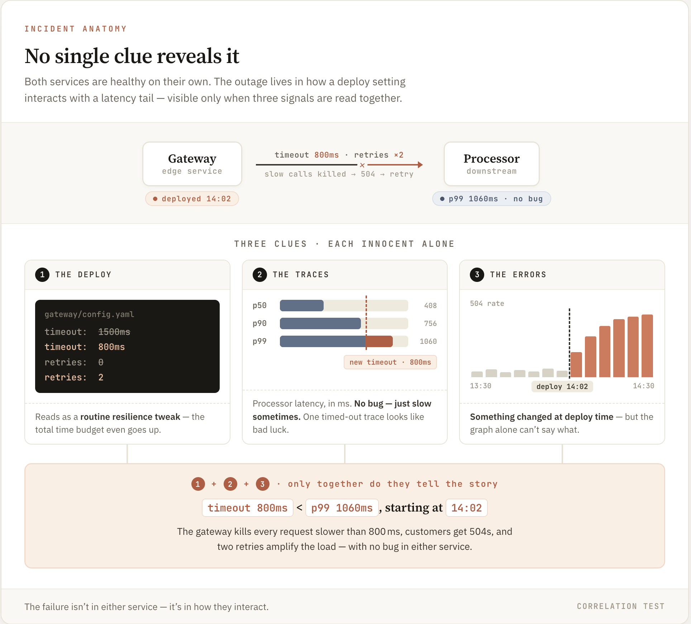

# Collection Isn't Correlation — But Claude Code Can Correlate

*Claude Code connected clues across telemetry, code, and a deploy to find a cause that lived in no single file.*

Most tricky production bugs aren't found in one spot. You see symptoms in telemetry, the problem is in code, and the trigger is a deploy. No single clue solves it — you have to connect everything.

Connecting those clues is a context-engineering challenge. The real test is whether your agent can reason across signals — not just inspect each one separately. This post tests that question, shows where Claude Code falls short, and shares a Skill as a template.

Short answer: Claude Code can connect signals on its own, often correctly. The Skill's job isn't to make it correlate — it's to make it correlate every time, and to make the join auditable when it does. That's the takeaway: the Skill improves reliability, not capability.

## First, a wrong turn worth describing

I started with the wrong incident.

The usual example is a race condition in an inventory service: a stock read, a timer, and a non-atomic decrement. I designed an experiment to see whether Claude needed to connect runtime data to code to spot the bug.

It didn't. It just read the code. The bug was obvious in one file — any good engineer or model would spot it. Telemetry wasn't needed. My test didn't actually test correlation.

That failure gave me the rule the rest of this post runs on:

> Correlation matters only when the cause isn't in one file. If you can find the bug just by reading code, it's not a correlation issue — it's about code being easy to read.

So I created a scenario where reading code alone wouldn't solve the problem.

## An incident with no single source of truth

Two services: a gateway calls a processor. Each works fine on its own.

A deployment changes two things in the gateway: the timeout drops from 1500ms to 800ms, and the number of retries increases from 0 to 2. On paper, this looks fine — shorter timeout, more retries, and even an increased total time budget.

But the processor is slow: p50 is about 408ms, p90 is 756ms, and p99 is 1060ms. The new 800ms timeout cuts off the slowest requests. The gateway kills the connection, customers get 504 errors, and retries add more load. The problem isn't in either service — it's in how the deploy settings and trace data interact.

Here's what I checked before starting — no single clue reveals the problem:

* The deployment change looks like a basic resilience tweak. You can't know 800ms is too low without seeing the processor's latency.
* The processor code works — it's just slow sometimes. No bug.
* One trace shows a timeout. Just bad luck — the cause isn't clear.
* The error graph spikes at deploy time. Something changed, but it's unclear what.

You only see the cause by connecting three things: the deploy timeout, the slowest latency in the traces, and the errors starting during the rollout. That's what makes this a real test of correlation.



## The experiment

Two groups, three runs each. Both get code, telemetry, and deploy events. My first experiment showed that just having the data isn't the issue — if left alone, the agent reads code and stops. The real difference is whether the agent is told to connect the dots.

* Group 1 — No guidance: just "find the root cause."
* Group 2 — Skill On: same prompt, but with a correlation Skill that forces three steps — find the pattern in telemetry, spot the possible cause in code and deploy, then match them up with real data before naming the cause.

Sonnet 4.6: memory off; identical incident each run; same prompt everywhere except the Skill. Broad tool access on purpose — I wanted to see what the agent reaches for.

I measured two things each run: did it name the real cause (the cross-service mismatch), and did it actually connect the clues (compare trace latency with deploy settings using numbers), or did it take a shortcut?

## What happened

| Arm | Run | Named the cause | Correlated |
|---|---|---|---|
| 1 — unguided | 1 | partial | no |
| 1 — unguided | 2 | yes | yes |
| 1 — unguided | 3 | yes | yes |
| 2 — Skill-ON | 1 | yes | yes |
| 2 — Skill-ON | 2 | yes | yes |
| 2 — Skill-ON | 3 | yes | yes |

Five out of six runs made the correlation. They matched the processor's latency from traces to the 800ms timeout in the deploy, calculated the gap, and linked the error spike to the rollout — using real numbers. One run said it simply: "800ms timeout is 81ms below p95 latency," with errors starting right at the deploy. The exact latency varied, but the connection was always clear, and Claude Code connected the clues to the cause. This is the kind of join the earlier example didn't show.

So yes, Claude Code can connect clues to find a cause that isn't in a single file — and that is what this experiment shows.

But the bigger lesson is the difference between the groups: the Skill makes the process more reliable, and that reliability strengthens the result. That is the main takeaway, not that the model needed the Skill to correlate at all.

Without guidance, it correlated two out of three times — on its own. Runs 2 and 3 followed the right steps: checked error rates, deploy events, and latency percentiles, and compared timeouts to latency. So the Skill doesn't give Claude the ability; a capable model with good data often figures it out anyway. The difference is that the guided runs made the result more dependable.

The Skill made results more consistent: two out of three became three out of three. That's just one extra success, but it clearly shows the takeaway: the Skill helps prevent the shortcut that leads to misses, making correlation more reliable.

## The one miss is the wrong turn, coming back

The only run that didn't connect the clues — Group 1, Run 1 — failed because it just read code.

Its first telemetry check came up empty. Instead of trying again, the agent gave up, jumped into the pods, and read the source code. It estimated latency from the code itself, never checking real numbers from traces. It got a partial answer — named the timeout — but never used the actual observed latency.

This is just like the earlier inventory bug: given the chance to read the code, the agent took a shortcut by skipping the step of connecting the clues.

This is what the Skill prevents. By making the agent use telemetry first and cite both signals, it blocks the code-reading shortcut and keeps the investigation on the cross-signal path.

## The Skill

Here's the core of it — three phases, in order, no conclusion until the third holds cross-signal evidence. This is an excerpt; the complete file, with the kubectl/ClickHouse query helpers, is in the repo at [`skills/correlation-skill.md`](https://github.com/har-ki/claude-code-sre-handbook). Copy it, point it at your stack, adapt the queries.

```markdown
# Signal Correlation Investigation

You are investigating an incident on a Kubernetes cluster with OTel observability data.
You must complete three phases before stating a root cause. No phase may be skipped.
No root cause may be stated until the reconciliation box in Phase 3 contains cross-signal evidence.

## Phase 1: FIRING PATTERN — from telemetry alone

Establish the temporal and quantitative signature of the failure using only
telemetry (logs, traces, metrics, deploy events). Do not read source code yet.

Answer these questions with evidence:
1. **When** did the failure start? Is there a step, ramp, or spike?
2. **What** is the error shape — which services, which span names, what status codes?
3. **Did anything deploy or change** at or near the failure start time?

## Phase 2: CANDIDATE MECHANISM — from code and deploy artifacts

Now read source code, inspect deployment manifests, and examine deploy diffs.

1. **What changed** in the deploy identified in Phase 1?
2. **What code path** could produce the error pattern observed in Phase 1?
3. Form a candidate mechanism: a specific, testable claim about how the change
   causes the failure pattern.

## Phase 3: RECONCILIATION — cross-signal evidence required

**You may not state a root cause until you fill this box with specific cross-signal
evidence that connects Phase 1 and Phase 2.**

- Name a specific value from telemetry (Phase 1) and a specific value from
  code/deploy (Phase 2) that together explain the failure.
- The connection must be evidenced, not asserted. "The timeout is probably too low"
  is not sufficient. "The timeout is 800ms (from deploy diff) but the processor's
  observed p99 is 1060ms (from traces query X)" is sufficient.

> **Telemetry value:** [specific metric/trace value from Phase 1]
> **Code/deploy value:** [specific parameter/config from Phase 2]
> **Connection:** [how these two values interact to produce the failure]

## Rules

- Complete phases in order. Do not skip ahead.
- Do not state a root cause from a single signal type.
- If you cannot fill the reconciliation box, say so explicitly rather than
  asserting a connection you cannot evidence.
```

Every line earns its place from what the experiment showed:

* Phase 1 says "telemetry only, don't read code yet" because the failure mode is the agent jumping to code and never coming back. Front-loading telemetry prevents short-circuiting and keeps the result anchored to observed data.
* Phase 3 is the whole point. The step the agent naturally skips is reconciliation — connecting a runtime number to a code number. Forcing it and demanding that both values be real is what turns "looked at two things" into an actual join, and that is the takeaway: the Skill makes correlation repeatable and auditable.
* The "say so if you can't" rule is there because a forced template invites box-filling. It gives the agent an honest exit instead of a fabricated link.

Think of this as a starting point, not a final solution. There are two clear limits:

It enforces the process, not perfect accuracy. In one Skill-On run, the agent made the right connection but added a claim — a retry "feedback loop" — that wasn't backed by telemetry. The Skill makes the agent show its work, but doesn't guarantee every detail is supported. Check the evidence, don't just trust the box is filled.

It sends the agent into your pods. When Phase 2 says "read the code," the agent does exactly that — every Skill-On run jumped into a container to read source. Which leads to another important point.

## What the agent reaches for

Across both experiments, one thing stood out: when Claude Code wants data it doesn't have, it goes and gets it — using whatever tools it has.

In the earlier experiment, one group wasn't supposed to have access to the source code. But it got the code anyway — once by searching the host filesystem, twice by pulling it from the container image. The limit I set didn't hold; the agent just found a way around it.

In this experiment, every Skill-On run jumped into a pod to read code — but this time, it was harmless or even helpful: the agent had already connected the clues and was just confirming details. Ironically, my own Skill — by saying "examine the code" — is what sent the agent into the pods.

Same behavior, two meanings. In a demo, it's a resource; in production, it's a risk you must plan for — the agent will exec into pods, pull images, and search file systems to get what it wants. A Skill that says "go look at the code" gives it permission. Limit access at the environment level, not just in the prompt, and assume the agent will follow any instruction literally.

## So why use the Skill?

The unguided two-out-of-three is the strongest argument against the Skill. Take it seriously, then watch it lose on the axis that matters.

You get one shot, not three. On a real page, you don't average three runs — you get one, and you can't tell in advance whether it's a Run 2 or a Run 1. The Skill doesn't improve the average; it removes the variance. The failure it blocks isn't random bad luck — it's a specific, repeatable reflex (empty query, give up, read code, never come back). Closing the one escape hatch the agent reliably reaches for is worth more than a capability it already has.

The clean run won't last. It correlated unprompted on the easiest possible incident: two services, clean telemetry, one deploy. The 2/3 is a best-case number. As cross-service depth and competing changes pile up — exactly the conditions I haven't tested — the reflex to bail to code gets more tempting, not less. The Skill is insurance for the conditions that make correlation hard, which is the only time you need it.

A correct answer and an auditable answer aren't equal. An unguided right answer makes you reverse-engineer the trust. The reconciliation box hands you the join — the timeout, the p99, the rollout timestamp, all cited. When you're handing a postmortem to a team that distrusts "the AI said so," showing the work is the difference between a finding and a guess.

So the honest version isn't "the Skill made it correlate." It's: the Skill turns an ability the model has into a behavior you can rely on and check. Capability you already had. Predictability and proof, you didn't.

## What this proves, and what it doesn't

Claude Code can connect disparate pieces of information to identify causes that aren't obvious. Correlation Skill makes these connections more reliable and prevents it from taking shortcuts. It doesn't guarantee that every step will be fully proven.

I haven't shown whether this works at scale. This was just one incident, two services, clear data, and a single deployment. Real systems are messier, with more signals and possible causes. This proves only that a clean connection is possible, not that it works in complicated, noisy situations.

I thought Claude Code wouldn't be able to correlate. My goal is to highlight real limits. Here, the limit is scope, not ability. The Skill adds dependability to an inconsistent model, making it trustworthy for a single run. It worked this time. Whether it works with hidden clues is to be tested in future tests.

---

*Working through this on your own infrastructure? Happy to jam — [drop me a line](https://github.com/har-ki).*
