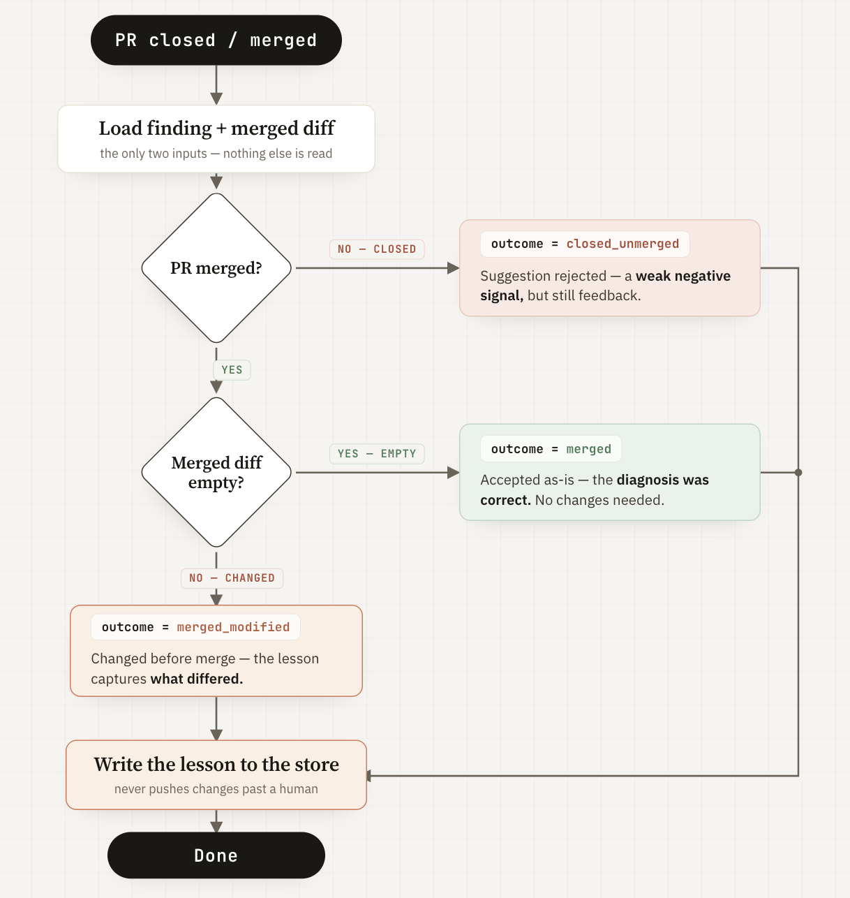

# The Merge Is the Signal

*For the watcher to truly learn, it needs real feedback. This feedback already exists — it's the merge.*

When a person merges, accepts, or rewrites the watcher's draft PR, it's an outside signal on whether the suggestion was good. A third Claude Code phase runs at merge, comparing the original suggestion to what actually shipped, and writes down the lesson. On-call engineers don't have to do anything extra — the feedback comes from what they already do.

[Earlier](15-remembering-isnt-learning.md), we said that if the watcher grades its own work, it quickly drifts off course. This post shows how to fix that by using an outside signal for feedback, building the loop around it, and proving that a merge changes how future investigations begin.

## Why the merge

Go back to the principle from [last post](15-remembering-isnt-learning.md): a self-improvement loop is only as good as the grounding of its feedback signal. The model can't be the judge of its own diagnosis — that's the failure mode the literature warns about. So the signal has to come from outside the agent.

The merge is that signal, and it has four properties that make it almost too good to pass up:

- **External.** A human decides, not the model. The agent can't author the verdict on its own work.
- **Binary.** Merged or not. Closed or not. No fuzzy self-assessment to game.
- **Privileged.** Merging is an action a reviewer takes deliberately, with their name on it. It carries weight that a comment or a thumbs-up doesn't.
- **Free.** It already happens. Every fix that ships gets merged; every bad diagnosis gets closed. The signal is a byproduct of work the team does anyway.

This is the key idea: The real work happens during review, when a human reads the draft PR and decides to accept, change, or reject it. The merge event provides real feedback and initiates the learning process. We don't ask people to rate the watcher — we just look at what they do with its output.

## What gets built

Three pieces, all in a new [`watcher-learning/`](https://github.com/har-ki/claude-code-sre-handbook/tree/main/watcher-learning) directory. This is the learning mechanism in isolation — not the full watcher. That's the next post.

### The store now tracks what happens next

Previously, the store just kept findings and their details, allowing us to look up similar past cases. Now, each finding also gets three new fields:

- **`outcome`**: `pending`, `merged`, `merged_modified`, or `closed_unmerged`
- **`verdict`**: a short note on what the merge showed
- **`lesson`**: a clear takeaway written after learning

A finding starts as `pending`, and most stay that way because merges often happen much later, or not at all. That's normal — the store still works fine with many pending findings. When an outcome finally appears, `recall()` includes it. Now, when you look up a past case, you see not just "what we found," but also "how it turned out" and "what we learned."

This change to the data structure is the backbone of the update. The rest is just making sure these fields are filled with reliable information.

### A third phase that learns

The watcher used to have two steps: investigate, then suggest a fix. Now there's a third step that runs when the code is merged. This new step is simple — it uses just two things:

- The original finding from the store
- The final merged code changes (the diff)

This is on purpose. The learning step only looks at the diff, because it's always there. It doesn't read commit messages or review comments, and it doesn't care how the bug was fixed — just what actually shipped. The diff is the truth, and only the truth should teach the system. Anything else is extra and not required.

Here's what the learning step does:

- If the merged diff is empty, the fix was accepted as-is. That means the diagnosis was correct. Set `outcome=merged` and note that no changes were needed.
- If the merged diff isn't empty, the fix was changed before merging. Set `outcome=merged_modified`. The lesson explains what was different and why it matters. This teaches the most: the suggestion was close, but needed improvement.
- If the pull request was closed without merging, the suggestion was rejected. Set `outcome=closed_unmerged`. This is a weaker negative signal, since PRs can be closed for many reasons. But it still gives some feedback.

This learning step only reads the diff and writes down what was learned — nothing more. It never tries to push changes past a human. It just learns from what actually got through the review.

### The trigger

The main method is a GitHub Action that runs when a pull request closes. It checks if the PR was merged, finds the fingerprint from the branch name, and starts the learning step. This all happens on GitHub, with no need for extra polling.

For offline or local setups, there's a simple script that checks the PR status using `gh pr view`. When the PR finishes, it runs the same learning step. Both ways feed into the same process, so the system works the same no matter how the merge is detected.

## Proof: a merge changing a later investigation

This proves merges change future investigations:

1. First, trigger the usual incident: `StockMismatchError` in `ecommerce-api`, fingerprint `e2836e74`. The watcher finds a bug (`StockMismatchError`), suggests an in-process mutex, and opens a draft PR. The finding is stored as `outcome=pending`.

2. A reviewer rewrites the fix to use a database lock (`SELECT FOR UPDATE`) and merges it. The system records: `outcome=merged_modified`, verdict=correct diagnosis but fix needed improvement, lesson=multi-instance race not just threads.

3. When the same issue happens again, the system recalls not just the old finding, but also the lesson: the mutex wasn't enough — check for issues across instances.

Because of the merge, the next investigation starts smarter. All three outcomes (merged as-is, merged with changes, rejected) were tested and update the system's memory.

## Where this sits, honestly

There are three real limits to this approach:

**Slow.** Learning becomes slow if merges take days. The loop only learns as fast as people review and merge code. Waiting for real feedback from others is slower but much more reliable.

**Sparse.** Only merged or closed pull requests teach the system. Everything else stays "pending".

**Merge isn't proof.** A merge just means a human approved the fix, not that it was actually correct. Careful reviews and quick approvals both count as merges, and the system can't tell the difference. Getting a human sign-off is still better than letting the model judge itself, but it isn't perfect. Sometimes the wrong lesson gets learned if a merge was careless.

## Where this sits in the arc

[Part 3](14-the-complete-watcher.md) gave the watcher its context — what it reasons against. This post gives it a way to update that context from outcomes it can't fake. Post 17 puts both together into a single production-shaped watcher and confronts the last problem head-on: what happens when the merge teaches the loop the wrong thing.

---

*The learning loop, store schema, triggers, and experiment artifacts are in [`watcher-learning/`](https://github.com/har-ki/claude-code-sre-handbook/tree/main/watcher-learning). The three-outcome run is under [`experiments/16-downstream/`](https://github.com/har-ki/claude-code-sre-handbook/tree/main/watcher-learning/experiments/16-downstream).*

---

*Working through this on your own infrastructure? Happy to jam — [drop me a line](https://github.com/har-ki).*
