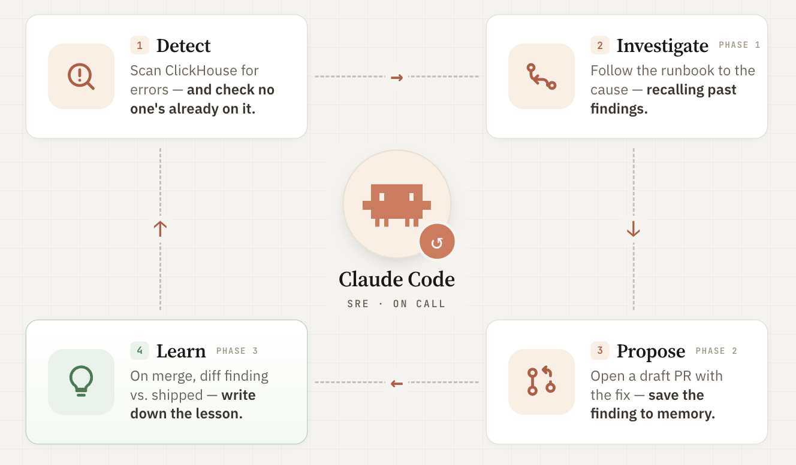

# The Complete Watcher: Context + Learning

*One watcher that investigates, proposes fixes, and learns from what actually ships.*

This post combines context engineering from Part 3 and the learning loop from Part 4 into one watcher. It investigates problems, suggests fixes, and learns from merged fixes. But it can still learn the wrong lesson if someone merges a bad solution.

Here, two important parts come together, and the focus is on ensuring everything fits and works well.

## What is the complete watcher?

Until now, everything was separate. [Part 3](14-the-complete-watcher.md) built a watcher that used context — runbooks, correlation, memory, and discipline — to make decisions. [Part 4](16-the-merge-is-the-signal.md) built a learning loop that learns from what gets merged. Now this post brings them together: one watcher in [`watcher-complete/`](https://github.com/har-ki/claude-code-sre-handbook/tree/main/watcher-complete) that does both.

The watcher now follows the same steps as before, but with a new third phase:

1. **Detect** — Check ClickHouse for errors, identify the problem, and make sure it's not already being fixed.
2. **Investigate (Phase 1)** — Use the runbook to look into the error, trace it to the cause, recall any past findings, and double-check them.
3. **Propose (Phase 2)** — Suggest a fix, open a draft PR, and save the finding to memory.
4. **Learn (Phase 3)** — When the PR is merged, compare the original finding to what was actually shipped, and write down what was learned.

A human still decides what gets merged. The watcher can suggest and learn, but it can't approve its own PR. That decision — and the learning — still depends on a person.

## Keeping memory and audit separate

Memory and audit stores remain separate. The agent learns from its own memory, while the audit trail is strictly for compliance and external review. Outcomes and lessons go only to the agent's store.

Recall now returns the finding, outcome, and lesson — but discipline is still crucial. Every lesson is a hypothesis, not a fact, and must always be verified against reality.

## Putting the watcher to the test

A full test on `kind-claude-sre-demo` showed the watcher working step by step. First, it found a `StockMismatchError` on `ecommerce-api` (fingerprint `e2836e74`). Recall found a previous finding, but no lesson had been learned yet. Next, in Phase 1, the watcher traced the error from `inventory.js:59` back to a non-atomic decrement at line 55 and a race window at line 53. Then, in Phase 2, it suggested using an in-process mutex and opened a draft PR.

A reviewer keeps the PR but rewrites the fix. Since an in-process mutex won't work across replicas, they switch to a database-level `SELECT FOR UPDATE` and merge the change. Then, in Phase 3, the watcher compares its suggested fix (the mutex) to the merged solution (row-locking) and records the lesson: the real problem was concurrency across instances, not just threads. When the same fingerprint is triggered again, Phase 1 starts with this lesson — "the in-process mutex wasn't enough; check for multi-instance concurrency" — instead of starting from scratch.

This matches what [Post 16](16-the-merge-is-the-signal.md) showed, but now it runs inside the fully integrated watcher.

## When the merge teaches the wrong thing

Merges aren't always correct.

A merge only means someone approved the change — not that the fix actually works. If a bad fix gets merged, the system can learn the wrong lesson.

When this happens, the agent may trust the wrong lesson, especially if it came from a merge. Only discipline — double-checking against reality — can catch these mistakes.

Bottom line: Merges are useful signals, but not the truth. If reviews are careless, the agent will pick up bad habits.

## The core lesson

[Part 3](09-the-context-problem.md) showed that the agent needs carefully designed context and discipline. Memory should help, not mislead.

[Part 4](15-remembering-isnt-learning.md) demonstrated that the agent can improve by learning from real signals — such as a merge.

The complete watcher combines both: it learns from real outcomes and relies on discipline to question its own memory. The goal isn't perfection, but a system that uses strong context, learns from experience, and always double-checks itself — because signals can be wrong, and only discipline keeps it honest.

---

*The complete watcher — context engineering plus the learning loop — is in [`watcher-complete/`](https://github.com/har-ki/claude-code-sre-handbook/tree/main/watcher-complete). The Part 3 context-only watcher stays at [`watcher-capstone/`](https://github.com/har-ki/claude-code-sre-handbook/tree/main/watcher-capstone) as the reference for a watcher that remembers but doesn't learn.*

---

*Working through this on your own infrastructure? Happy to jam — [drop me a line](https://github.com/har-ki).*
